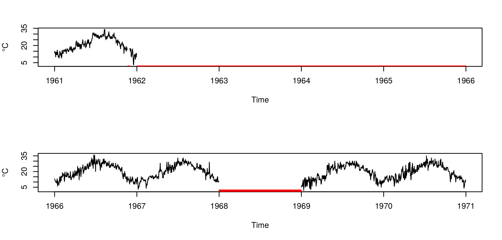

```{r setup, include=FALSE}
options(htmltools.dir.version = FALSE)
```

```{r,include=FALSE,message=FALSE,warning=FALSE,echo=FALSE}
library("emojifont")
```

class: middle, center

background-image: url(./figure/logoispra_hr.png)
background-size: 15%
background-position: 50% 90%

# [SCIA <br/><br/> Sistema nazionale<br/><br/> <small>per l'elaborazione e diffusione<br/><br/>dei dati climatici</small>](http://www.scia.isprambiente.it)

---

class: inverse, middle,center

# Controlli di qualità dei dati<br/> <br/> `r emojifont::emoji("microscope")` 

.footnote[La disponibilità di lunghe serie di dati strumentali di buona qualità è di fondamentale importanza per lo  studio  della  variabilità  del  clima  e  in  particolare  degli  eventi  estremi.]

---

# Controlli di qualità dei dati

- _omogeneità_ dei controlli 

- controlli _automatici_

I controlli su SCIA sono un sottoinsieme dei controlli per il dataset:

.center[ **Global Historical Climatological Network**<br/>(National Climatic  Data  Center - NOAA)] 
 
<br/> 


.pull-left[.full-width[.content-box-yellow[[Comprehensive Automated Quality Assurance of Daily Surface Observations](https://journals.ametsoc.org/jamc/article/49/8/1615/13419/Comprehensive-Automated-Quality-Assurance-of-Daily) <br/> <small>Durre et al., 2010</small> `r emojifont::emoji("point_left")`]]]

.pull-right[.full-width[.content-box-yellow[[Controlli di qualità delle serie di temperatura e  precipitazione](http://www.scia.isprambiente.it/wwwrootscia/Documentazione/Rapporto_controlli_qualit%c3%a0_clima.pdf) <br/> <small>ISPRA, 2016</small> `r emojifont::emoji("point_left")`]]]

---

# Controlli di qualità dei dati

**Quattro tipologie di controlli:**

- Test di integrità di base

- Test per l’identificazione dei valori anomali

- Test di consistenza interna e temporale

- Test di consistenza spaziale (**solo per le serie di temperatura**) `r emojifont::emoji("point_left")`

### Quale software? `r emojifont::emoji("thinking")`
 
Alcuni controlli di qualità sono implementati nei pacchetti R:

- [RClimDex](https://github.com/ECCC-CDAS/RClimDex) `r emojifont::emoji("point_left")`

- [dataresqc](https://datarescue.climate.copernicus.eu/node/54) `r emojifont::emoji("point_left")`
 
---
class: middle

# Controlli di qualità dei dati 

.pull-left[
| Anno | mese | giorno | Tmax | Tmin |
| --- | --- | --- | --- | --- |
|2003|10|4|29.4|29.4|
|2003|10|5|29.4|29.4|
|2003|10|6|29.4|29.4|
|2003|10|7|29.4|29.4|
|2003|10|8|29.4|29.4|
|2003|10|9|29.4|29.4|
|2003|10|10|29.4|29.4|
|2003|10|11|29.4|29.4|
|2003|10|12|29.4|29.4|
|2003|10|13|29.4|29.4|
|2003|10|14|29.4|29.4|
|---|---|---|---|---|

]

.pull-right[
| Anno | mese | giorno | Tmax | Tmin |
| --- | --- | --- | --- | --- |
|2003|10|23|18.9|18.9|
|2003|10|24|18.9|18.9|
|2003|10|25|18.9|18.9|
|2003|10|26|18.9|18.9|
|2003|10|27|18.9|18.9|
|2003|10|28|18.9|18.9|
|2003|10|29|18.9|18.9|
|2003|10|30|18.9|18.9|
|2003|10|31|18.9|18.9|
|---|---|---|---|---|
]

---

# Controlli di qualità dei dati

.center[]

---

# Controlli di qualità dei dati

.center[]

---

# Controlli di qualità dei dati

.center[]

---

class: inverse,middle,center

# Lunghezza, completezza e continuità <br/><br/> `r emojifont::emoji("link")` <br/><br/> delle serie climatiche

---

# Completezza e continuità delle serie

I criteri del WMO per il calcolo dei valori climatologici vengono comunemente utilizzati come criterio di completezza delle serie ([Anderson and Gough, 2018](https://rmets.onlinelibrary.wiley.com/doi/pdf/10.1002/joc.5801))

### Temperatura 

Regola del "_3/5_": **ammessi 5 valori giornalieri NA, di cui al più 3 consecutivi.**

### Precipitazione

Criteri molto restrittivi: **un solo dato giornaliero NA invalida il corrispettivo aggregato mensile.**

### Aggregazione dati mensili

- Un anno in cui almeno un mese è NA non viene considerato valido
- Un criterio meno stringente: accettare fino a 3 mesi NA purchè non tutti alla stessa stagione

---

background-image: url(./figure/metro.png)
background-size: 50% 100%
background-position: 165% 0%

# Lunghezza delle serie
.left-column[
#### Quali gli obiettivi dell'analisi?? 
]

--

.right-column[
- stima dei trend di lungo periodo:
  - 30 anni di dati (?)
]

--

.right-column[
- valori climatologici:
  - almeno 24 anni su 30<br/>(valori climatologici standard WMO)
  - valori climatologici NON standard<br/> (20 anni su 30, 15 anni su 30 ...)
]

--

.right-column[
- omogeneizzazione delle serie:  
  - anche serie brevi (20 anni) possono<br/>contribuire all'omogeneizzazione<br/> di serie più lunghe
]

---

# Completezza e continuità delle serie



- Serie con almeno l'80% degli anni validi

- al  massimo  quattro  anni  consecutivi  mancanti

---

class: middle,center

<!-- # Criteri per l'elaborazione delle serie di temperatura -->


---

class: inverse,middle,center

# Omogeneizzazione delle serie climatiche <br/> <br/> `r emojifont::emoji("hammer")` 

.footnote[Una serie omogenea è una serie la cui variabilità dipende solo da fattori climatici]

---

# Omogeneizzazione (temperatura)

Discontinuità artificiali nel segnale climatico. Ad esempio:

- nuove procedure di elaborazione dei dati

- spostamento della stazione osservativa

- nuova strumentazione

### Software per omogeneizzazione _automatica_? `r emojifont::emoji("thinking")`

- [climatol](https://cran.r-project.org/web/packages/climatol/index.html)

- [ACMANT](https://github.com/dpeterfree/ACMANT) `r emojifont::emoji("man_shrugging")` non disponibile come pacchetto R

Metodi di omogeneizzazione **relativi**.

`climatol`: utilizza _serie brevi_ per omogeneizzare le _serie lunghe_ in sottoperiodi. 

---

# Omogeneizzazione (precipitazione)

L'integrità delle serie di precipitazione è stata testata seguendo l'approccio descritto da Wijngaard et al., (2003) nel paper:

.center[[Homogeneity of 20th century European daily temperature and precipitation series](https://rmets.onlinelibrary.wiley.com/doi/10.1002/joc.906).]

Quattro test statistici:
- Standard Normal Homogeneity Test
- Buishand range test
- Pettitt test
- Von Neumann ratio test

Le serie _sospette_ sono state escluse dall'analisi, nessun processo di omogeneizzazione.

### Software per testate l'omogeneità delle serie? `r emojifont::emoji("thinking")`

- [trend](https://cran.r-project.org/web/packages/trend/vignettes/trend.pdf)
- [climtrends](https://cran.r-project.org/src/contrib/Archive/climtrends/)

`climtrends` attualmente non più sviluppato.

---

class: inverse,middle,center

# Stima dei trend <br/> <br/>`r emojifont::emoji("chart_with_upwards_trend")`  

---

<!-- background-image: url(./figure/raw_vs_omog_trend.png)
background-position: 100% 80%
background-size: 50% -->

# Stima dei trend

- regressione lineare _classica_ (ipotesi: residui i.i.d)

- stimatore **non parametrico** di Theil-Sen e test non parametrico di Mann-Kendall

.center[]

La funzione `zyp.trend.csv/zyp.trend.vector` del pacchetto R [zyp](https://cran.r-project.org/web/packages/zyp/zyp.pdf) implementa il _pre-whitening_ della serie temporale.

---

class: inverse,middle,center

# Calcolo degli estremi climatici<br/><br/> `r emojifont::emoji("cloud_with_lightning")`

---

# Calcolo degli estremi climatici

.center[]

---

# Calcolo degli estremi climatici


.center[]


---

# Calcolo degli estremi climatici

ETCCDI: _Expert Team on Climate Change Detection and Indices_

- Utilizzano i dati giornalieri di temperatura e precipitazione

- Estremi climatici **moderati** 

- Criteri di completezza molto rigidi

- ET-SCI: _Expert Team on Sector Specific Climate Indices_

### Quale software? `r emojifont::emoji("thinking")`

- [climdex.pcic](https://github.com/pacificclimate/climdex.pcic): indici ETCCDI 

- [ClimPACT2](https://github.com/ARCCSS-extremes/climpact2): Indici ET-SCI<sup>1</sup>

.footnote[[1] Expert Team on Sector-Specific Climate Indices]
---

class: middle

# Altre  informazioni

.pull-left[.center[[A new homogenized daily dataset<br/>for temperature variability assessment in Italy](https://doi.org/10.1002/joc.6177)

<small>Fioravanti G., Piervitali E., Desiato F.<br/>Int J Climatol. 2019; 39: 5635– 5654</small>
]]

.pull-right[.center[[Variazioni della temperatura in Italia: estensione della base dati <br/>e aggiornamento della <br/>metodologia di calcolo](http://www.scia.isprambiente.it/wwwrootscia/Documentazione/SA_81_18_Variazioni_temperatura.pdf).

<small>Fioravanti G., Piervitali, E.<br/>ISPRA, 2018</small>
]]


.full-width[.content-box-yellow[In [questa pagina](https://github.com/scia-ispra/indici_climatici) sono raccolte alcune informazioni (documenti tecnici, software, papers) utili all'elaborazione delle serie climatiche]]

---

class: middle, center, duke-orange

# L'ottimo è nemico del buono! 

---

class: middle, center, inverse

# Grazie per l'attenzione! <br/><br/> `r emojifont::emoji("clinking_glasses")`
  